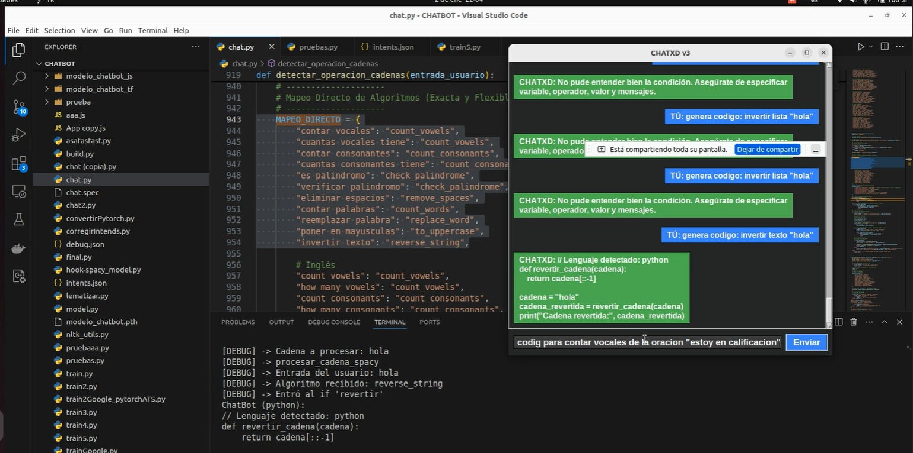
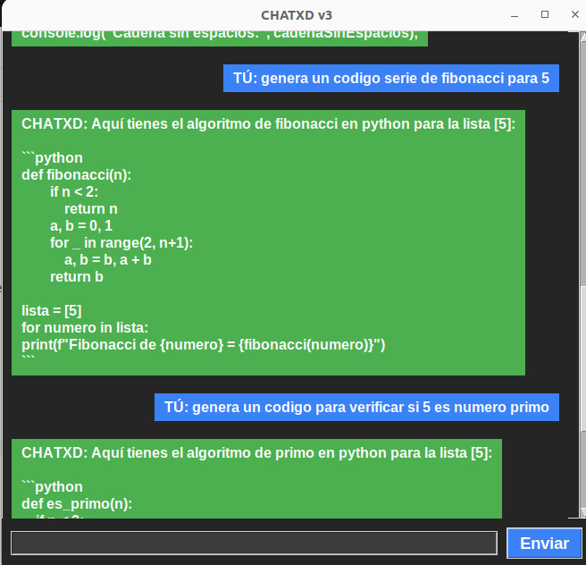

# **Manual Tecnico Proyecto Fase 2 Inteligencia Artificial 1**

## **Introducción**
En este documento se describe los aspectos técnicos informáticos de la aplicación de escritorio, de manera que cualquier técnico informático pueda entender y comprender la lógica dentro del programa, para así poder darle mantenimiento y actualizarla si es necesario.


## **Objetivo Gerneral**

- Implementar lo aprendido en la clase magistral y laboratorio en la creación de un
modelo que sea capaz de entender entradas de texto y responder de forma coherente
a las mismas.

## **Objetivos específicos**
- Seleccionar una biblioteca en el lenguaje de JavaScript que permita la creación de un
modelo de inteligencia artificial.
- Desarrollar un modelo que sea capaz de recibir entradas en idioma español y
responder a las mismas.

## **Requisitos del sistema**
- CPU, Intel Core 3  2 GHz recomendado.
- RAM, 2 GB recomendado. 
- Sistema Operativo windows 10,11.
- Navegador web.

## Red Neuronal feed-forward con dos capas ocultas

En la imagen se visualiza la representación de texto mediante el método de Bolsa de Palabras (Bag of Words) en un conjunto de datos de entrenamiento para un modelo de clasificación, se forma un vector y dependiendo de el vector lo enlaza con una intención.

## Librerias utilizadas

- random: Para seleccionar respuestas aleatorias.
- json: Para cargar datos del archivo intents.json.
- torch: Para trabajar con PyTorch.
- NeuralNet: Modelo de red neuronal definido en model.py.
- vector_bolsa_de_palabras y dividir_en_palabras: Funciones auxiliares para procesar texto.
- re: Para manejar expresiones regulares.

```
import random
import json
import torch
from model import NeuralNet
from nltk_utils import vector_bolsa_de_palabras, dividir_en_palabras
import re

```

## Configuración del dispostivo

```
dispositivo = torch.device('cuda' if torch.cuda.is_available() else 'cpu')

```


## Cargar Datos y modelo Entrenado 

Se cargan los datos de intenciones y el modelo entrenado previamente guardado en modelo_chatbot.pth.

```
with open('intents.json', 'r') as archivo:
    intenciones = json.load(archivo)

modelo_entrenado = torch.load("modelo_chatbot.pth")

```

## Configuracion del modelo 

Se extraen los tamaños de entrada, salida y capa oculta, así como las palabras y etiquetas. Luego, se carga el modelo y se establece en modo de evaluación (eval()).


```
tam_entrada = modelo_entrenado["input_size"]
tam_oculto = modelo_entrenado["hidden_size"]
tam_salida = modelo_entrenado["output_size"]
palabras = modelo_entrenado["all_words"]
etiquetas = modelo_entrenado["tags"]
estado_modelo = modelo_entrenado["model_state"]

modelo = NeuralNet(tam_entrada, tam_oculto, tam_salida).to(dispositivo)
modelo.load_state_dict(estado_modelo)
modelo.eval()

```

## Red Neuronal

Clasificacion de texto para el chatbot, recibe como entrada un vector de caracteristicas, produce las salidas para cada clase, uso de softmax para probablidad de clasificacion.

Este método define cómo la red procesa los datos en el paso de inferencia:

- Primera Capa: Se pasa x a través de l1 y se aplica ReLU.
- Segunda Capa: Se pasa a l2 y se aplica ReLU nuevamente.
- Tercera Capa: Se pasa a l3

```
import torch
import torch.nn as nn


class NeuralNet(nn.Module):
    def __init__(self, input_size, hidden_size, num_classes):
        super(NeuralNet, self).__init__()
        self.l1 = nn.Linear(input_size, hidden_size) 
        self.l2 = nn.Linear(hidden_size, hidden_size) 
        self.l3 = nn.Linear(hidden_size, num_classes)
        self.relu = nn.ReLU()

    def forward(self, x):
        out = self.l1(x)
        out = self.relu(out)
        out = self.l2(out)
        out = self.relu(out)
        out = self.l3(out)
        return out
```

## Stemer, Depuracion y Almacenado de datos

El archivo nlkt_utils.py contiene el stemer para poder procesar las palabras en español, archiva los datos de depuracion y almacena los datos, los datos se almacenan en un archivo JSON, se dividen en tokens y se convierten a minusculas, se maneja a travez de vectores.

```
import numpy as np
import nltk
from nltk.stem.snowball import SnowballStemmer
import re
import json

# Inicializar el stemmer para procesar palabras en español
stemmer = SnowballStemmer("spanish")

# Archivo para guardar los datos de depuración
archivo_debug = "debug.json"

# Estructura para almacenar los datos de depuración
datos_debug = {
    "tokens": [],
    "raices": [],
    "vector_bolsa_de_palabras": []
}

def guardar_debug():
    """Guarda los datos de depuración en un archivo JSON."""
    with open(archivo_debug, "w") as archivo:
        json.dump(datos_debug, archivo, indent=4, ensure_ascii=False)

def dividir_en_palabras(oracion):
    """
    Divide una oración en palabras o tokens y convierte a minúsculas.
    """
    oracion = oracion.lower()
    oracion = re.sub(r'([\+\-\*/])', r' \1 ', oracion)  # Separar operadores matemáticos
    tokens = nltk.word_tokenize(oracion, language="spanish")
    
    # Guardar tokens en datos de depuración
    datos_debug["tokens"].append({"oracion": oracion, "tokens": tokens})
    guardar_debug()
    return tokens

def obtener_raiz(palabra):
    """
    Reduce una palabra a su forma raíz, excepto para palabras clave matemáticas y números.
    """
    excepciones = ["suma", "resta", "multiplicacion", "division", "+", "-", "*", "/"]
    if palabra in excepciones or palabra.isdigit():
        return palabra
    return stemmer.stem(palabra)

def vector_bolsa_de_palabras(oracion_tokenizada, palabras_conocidas):
    """
    Convierte una oración tokenizada en un vector de bolsa de palabras.
    """
    palabras_raiz = [obtener_raiz(palabra) for palabra in oracion_tokenizada]
    
    # Guardar raíces generadas en datos de depuración
    datos_debug["raices"].append({"tokens": oracion_tokenizada, "raices": palabras_raiz})
    
    vector = np.zeros(len(palabras_conocidas), dtype=np.float32)
    for idx, palabra in enumerate(palabras_conocidas):
        if palabra in palabras_raiz:
            vector[idx] = 1
    
    # Guardar vector generado en datos de depuración
    datos_debug["vector_bolsa_de_palabras"].append({"raices": palabras_raiz, "vector": vector.tolist()})
    guardar_debug()
    return vector

```

## Lectura, procesamiento, filtrado y entrenamiento 

En este archivo train.py contiene secciones importantes filtra palabras irrelevantes y procesar raíces, crea conjuntos de entrenamiento, se encarga de crear el dataset personalizado.

- Configura el dispositivo.
- Crea el modelo
- Entrenamiento
- Guardar modelo entrenado.
  
```
import numpy as np
import random
import json

import torch
import torch.nn as nn
from torch.utils.data import Dataset, DataLoader
from tqdm import tqdm

from nltk_utils import vector_bolsa_de_palabras, dividir_en_palabras, obtener_raiz
from model import NeuralNet

# Leer el archivo de intenciones
with open('intents.json', 'r') as archivo:
    intenciones = json.load(archivo)

palabras = []
etiquetas = []
datos_entrenamiento = []

# Procesar el archivo de intenciones
for intencion in intenciones['intents']:
    etiqueta = intencion['tag']
    etiquetas.append(etiqueta)
    for patron in intencion['patterns']:
        tokens = dividir_en_palabras(patron)
        palabras.extend(tokens)
        datos_entrenamiento.append((tokens, etiqueta))

# Filtrar palabras irrelevantes y procesar raíces
ignorar = ignorar = ['?', '.', '!', ',', ':', ';', '...', '(', ')', '[', ']', '{', '}', '-', '_', '/', '|', '\\', '*', '=', '"', "'", '«', '»']
palabras = [obtener_raiz(palabra) for palabra in palabras if palabra not in ignorar]
palabras = sorted(set(palabras))
etiquetas = sorted(set(etiquetas))

# Crear conjuntos de entrenamiento
entradas = []
salidas = []
for (tokens, etiqueta) in datos_entrenamiento:
    vector = vector_bolsa_de_palabras(tokens, palabras)
    entradas.append(vector)
    salidas.append(etiquetas.index(etiqueta))

entradas = np.array(entradas)
salidas = np.array(salidas)

# Hiperparámetros
epocas = 1000
tamanio_lote = 8
tasa_aprendizaje = 0.001
tam_entrada = len(entradas[0])
tam_oculto = 8
tam_salida = len(etiquetas)

# Crear el dataset personalizado
class DatasetConversacional(Dataset):
    def __init__(self):
        self.num_muestras = len(entradas)
        self.x = entradas
        self.y = salidas

    def __getitem__(self, indice):
        return self.x[indice], self.y[indice]

    def __len__(self):
        return self.num_muestras

dataset = DatasetConversacional()
loader = DataLoader(dataset=dataset, batch_size=tamanio_lote, shuffle=True)

# Configurar dispositivo
dispositivo = torch.device('cuda' if torch.cuda.is_available() else 'cpu')

# Crear el modelo
modelo = NeuralNet(tam_entrada, tam_oculto, tam_salida).to(dispositivo)

# Configurar función de pérdida y optimizador
criterio = nn.CrossEntropyLoss()
optimizador = torch.optim.Adam(modelo.parameters(), lr=tasa_aprendizaje)

# Entrenamiento
for epoca in range(epocas):
    with tqdm(loader, desc=f"Época {epoca+1}/{epocas}") as barra:  # Barra de progreso
        for lotes_x, lotes_y in barra:
            lotes_x = lotes_x.to(dispositivo)
            lotes_y = lotes_y.to(dispositivo)

            salida = modelo(lotes_x)
            perdida = criterio(salida, lotes_y)

            optimizador.zero_grad()
            perdida.backward()
            optimizador.step()

            # Actualizar la barra con la pérdida actual
            barra.set_postfix({"Pérdida": perdida.item()})

    if (epoca + 1) % 100 == 0:
        print(f"Época [{epoca+1}/{epocas}], Pérdida: {perdida.item():.4f}")

print(f"Pérdida final: {perdida.item():.4f}")

# Guardar modelo entrenado
modelo_entrenado = {
    "model_state": modelo.state_dict(),
    "input_size": tam_entrada,
    "hidden_size": tam_oculto,
    "output_size": tam_salida,
    "all_words": palabras,
    "tags": etiquetas,
}

print(f"Tamaño del vocabulario utilizado: {len(palabras)}")

torch.save(modelo_entrenado, "modelo_chatbot.pth")
print("Entrenamiento completo. Modelo guardado como 'modelo_chatbot.pth'")
print(f"[DEBUG] Vocabulario Entrenado: {palabras}")

```

- El archivo train2.py contiene exportado el vocabulario en un Json y exporta el modelo en .pth para poder transformar a tensor Flow y despues de esto poder pasarlo a JS.
  
```
import json
import numpy as np
import tensorflow as tf
import nltk
from nltk.stem.snowball import SnowballStemmer
import re

# Inicializar el stemmer para procesar palabras en español
stemmer = SnowballStemmer("spanish")

# Archivo para guardar los datos de depuración
archivo_debug = "debug.json"

# Estructura para almacenar los datos de depuración
datos_debug = {
    "tokens": [],
    "raices": [],
    "vector_bolsa_de_palabras": []
}

def guardar_debug():
    """Guarda los datos de depuración en un archivo JSON."""
    with open(archivo_debug, "w") as archivo:
        json.dump(datos_debug, archivo, indent=4, ensure_ascii=False)

def dividir_en_palabras(oracion):
    """
    Divide una oración en palabras o tokens y convierte a minúsculas.
    """
    oracion = oracion.lower()
    oracion = re.sub(r'([\+\-\*/])', r' \1 ', oracion)  # Separar operadores matemáticos
    tokens = nltk.word_tokenize(oracion, language="spanish")
    
    # Guardar tokens en datos de depuración
    datos_debug["tokens"].append({"oracion": oracion, "tokens": tokens})
    guardar_debug()
    return tokens

def obtener_raiz(palabra):
    """
    Reduce una palabra a su forma raíz, excepto para palabras clave matemáticas y números.
    """
    excepciones = ["suma", "resta", "multiplicacion", "division", "+", "-", "*", "/"]
    if palabra in excepciones or palabra.isdigit():
        return palabra
    return stemmer.stem(palabra)

def vector_bolsa_de_palabras(oracion_tokenizada, palabras_conocidas):
    """
    Convierte una oración tokenizada en un vector de bolsa de palabras.
    """
    palabras_raiz = [obtener_raiz(palabra) for palabra in oracion_tokenizada]
    
    # Guardar raíces generadas en datos de depuración
    datos_debug["raices"].append({"tokens": oracion_tokenizada, "raices": palabras_raiz})
    
    vector = np.zeros(len(palabras_conocidas), dtype=np.float32)
    for idx, palabra in enumerate(palabras_conocidas):
        if palabra in palabras_raiz:
            vector[idx] = 1
    
    # Guardar vector generado en datos de depuración
    datos_debug["vector_bolsa_de_palabras"].append({"raices": palabras_raiz, "vector": vector.tolist()})
    guardar_debug()
    return vector

# Leer intenciones
with open('intents.json', 'r') as archivo:
    intenciones = json.load(archivo)

# Procesar datos
palabras = []
etiquetas = []
datos_entrenamiento = []

ignorar = ['?', '.', '!', ',', ':', ';', '...', '(', ')', '[', ']', '{', '}', '-', '_', '/', '|', '\\', '*', '=', '"', "'", '«', '»']

for intencion in intenciones['intents']:
    etiqueta = intencion['tag']
    etiquetas.append(etiqueta)
    for patron in intencion['patterns']:
        tokens = dividir_en_palabras(patron)
        palabras.extend([obtener_raiz(token) for token in tokens if token not in ignorar])
        datos_entrenamiento.append((tokens, etiqueta))

palabras = sorted(set(palabras))
etiquetas = sorted(set(etiquetas))

# Crear vectores de bolsa de palabras
entradas = []
salidas = []

for tokens, etiqueta in datos_entrenamiento:
    vector = vector_bolsa_de_palabras(tokens, palabras)
    entradas.append(vector)
    salidas.append(etiquetas.index(etiqueta))

entradas = np.array(entradas)
salidas = tf.keras.utils.to_categorical(salidas, num_classes=len(etiquetas))

# Crear modelo
modelo = tf.keras.Sequential([
    tf.keras.layers.Dense(128, input_shape=(len(entradas[0]),), activation='relu'),
    tf.keras.layers.Dropout(0.5),
    tf.keras.layers.Dense(64, activation='relu'),
    tf.keras.layers.Dropout(0.5),
    tf.keras.layers.Dense(len(etiquetas), activation='softmax')
])

# Compilar el modelo
modelo.compile(loss='categorical_crossentropy', optimizer=tf.keras.optimizers.Adam(learning_rate=0.001), metrics=['accuracy'])

# Entrenar el modelo
modelo.fit(entradas, salidas, epochs=1000, batch_size=8, verbose=1)

# Guardar vocabulario en un archivo JSON
with open("vocabulario.json", "w") as archivo:
    json.dump(palabras, archivo, indent=4, ensure_ascii=False)
print("Vocabulario guardado como 'vocabulario.json'")

print(f"Tamaño del vocabulario utilizado: {len(palabras)}")

# Guardar el modelo en formato SavedModel
modelo.export("modelo_chatbot_tf")

print("Modelo guardado como SavedModel en 'modelo_chatbot_tf'")
print(f"[DEBUG] Vocabulario Entrenado: {palabras}")

```

# Procesamiento de Palabras en Español e Inglés con JavaScript

   El enfoque incluye normalización, tokenización, mapeo dinámico de raíces y la creación de un vector de bolsa de palabras.

  

---

  

## 1. Tokenización con `wink-tokenizer`

  

Para dividir una oración en palabras, utilizamos la librería `wink-tokenizer`. El código inicializa un tokenizador y define funciones para procesar palabras:

  

```javascript

import  winkTokenizer  from  'wink-tokenizer';

  

const  tokenizer = new  winkTokenizer();

```

  

---

  

## 2. Normalización de Palabras

  

La función `normalizarToken` convierte palabras a minúsculas y elimina acentos para uniformizar los tokens, facilitando su comparación.

  

```javascript

/**

* Normaliza un token para comparación (elimina tildes, pasa a minúsculas).

* @param  {string}  token - Token a normalizar.

* @returns  {string} - Token normalizado.

*/

const  normalizarToken = (token) =>

token.normalize('NFD').replace(/[̀-ͯ]/g, '').toLowerCase();

```

  

### Ejemplo:

Entrada: `"Avión"`

Salida: `"avion"`

  

---

  

## 3. Búsqueda de Raíces en el Vocabulario

  

La función `encontrarRaizDinamica` busca la forma más relevante de una palabra en un vocabulario conocido. Esto incluye coincidencias exactas, búsqueda de prefijos y formas con prefijos `##`.

  

```javascript

/**

* Encuentra la raíz más relevante en el vocabulario, considerando prefijos.

* @param  {string}  token - La palabra a buscar.

* @param  {Set<string>}  vocabulario - Un conjunto de palabras conocidas (para eficiencia).

* @returns  {string} - La raíz más cercana encontrada en el vocabulario o el token original.

*/

const  encontrarRaizDinamica = (token, vocabulario) => {

const  tokenNormalizado = normalizarToken(token);

  

if (vocabulario.has(tokenNormalizado)) {

return  tokenNormalizado;

}

  

for (let  i = tokenNormalizado.length; i > 0; i--) {

const  prefijo = tokenNormalizado.slice(0, i);

if (vocabulario.has(prefijo)) {

return  prefijo;

}

}

  

for (let  item  of  vocabulario) {

if (item.startsWith('##') && item.slice(2) === tokenNormalizado) {

return  item;

}

}

  

return  tokenNormalizado;

};

```

  

---

  

## 4. División en Palabras y Mapeo de Raíces

  

La función `dividirEnPalabras` tokeniza una oración y convierte cada palabra a su raíz más relevante.

  

```javascript

/**

* Divide una oración en palabras y aplica un mapeo dinámico de raíces.

* @param  {string}  oracion - La entrada del usuario.

* @param  {string[]}  palabrasConocidas - Lista de palabras en el vocabulario.

* @returns  {string[]} - Lista de raíces de las palabras (tokens procesados).

*/

export  const  dividirEnPalabras = (oracion, palabrasConocidas) => {

const  vocabulario = new  Set(palabrasConocidas.map(normalizarToken));

const  tokens = tokenizer.tokenize(oracion.toLowerCase())

.filter(token  =>  token.tag === 'word' || token.tag === 'number')

.map(token  =>  token.value);

  

const  tokensConRaices = tokens.map(token  =>  encontrarRaizDinamica(token, vocabulario));

  

console.log(`[DEBUG] Tokens originales: ${tokens}`);

console.log(`[DEBUG] Tokens con raíces: ${tokensConRaices}`);

return  tokensConRaices;

};

```

  

---

  

## 5. Creación de un Vector de Bolsa de Palabras

  

La función `vectorBolsaDePalabras` genera un vector binario indicando la presencia de cada palabra del vocabulario en los tokens procesados.

  

```javascript

/**

* Convierte una lista de raíces en un vector de bolsa de palabras.

* @param  {string[]}  tokens - Raíces de las palabras procesadas.

* @param  {string[]}  palabrasConocidas - Palabras del vocabulario.

* @returns  {number[]} - Vector de bolsa de palabras.

*/

export  const  vectorBolsaDePalabras = (tokens, palabrasConocidas) => {

const  palabrasNormalizadas = palabrasConocidas.map(palabra  =>  palabra.toLowerCase());

const  vector = Array(palabrasNormalizadas.length).fill(0);

  

tokens.forEach(token  => {

const  tokenNormalizado = token.toLowerCase();

  

let  indice = palabrasNormalizadas.indexOf(tokenNormalizado);

  

if (indice === -1) {

indice = palabrasNormalizadas.indexOf(`##${tokenNormalizado}`);

}

  

if (indice !== -1) {

vector[indice] = 1;

console.log(`[DEBUG] Token "${token}" encontrado en índice ${indice}`);

} else {

console.warn(`[DEBUG] Token "${token}" no encontrado en el vocabulario`);

}

});

  

console.log(`[DEBUG] Vector de bolsa de palabras generado: ${vector}`);

return  vector;

};

```

  

### Ejemplo:

-  **Entrada Tokens**: `["hola", "mundo"]`

-  **Vocabulario**: `["hola", "mundo", "adios"]`

-  **Vector Generado**: `[1, 1, 0]`

  

---

  

## 6. Flujo del Proceso

  

1.  **Entrada del Usuario**: Una oración o frase.

2.  **Tokenización**: División en palabras.

3.  **Normalización**: Eliminar acentos y convertir a minúsculas.

4.  **Mapeo de Raíces**: Buscar formas relevantes en el vocabulario.

5.  **Bolsa de Palabras**: Generar un vector indicando la presencia de cada palabra en la entrada.

  

---

  
    

# Entrenamiento del Chatbot en Google Colab

  

Este documento explica el enfoque utilizado para entrenar el modelo de chatbot en Google Colab. Se destacan las herramientas elegidas, incluyendo la lematización para inglés, el stemming para español y el tokenizador multilingüe de Hugging Face.

  

---

  

## ¿Por qué se usaron estas herramientas específicas?

  

1.  **Lematizador (Inglés):** Se utilizó el `WordNetLemmatizer` de NLTK por su eficiencia para manejar palabras en inglés, ya que ayuda a reducir las palabras a su forma base en el diccionario.

2.  **Stemmer (Español):** El `SnowballStemmer` es eficiente para manejar formas flexionadas en español, simplificando la gestión del vocabulario.

3.  **Tokenizador de Hugging Face:** Se empleó el tokenizador `bert-base-multilingual-cased` por su robustez para manejar múltiples idiomas, proporcionando salidas tokenizadas que soportan tanto texto en español como en inglés.

4.  **Optimización:** Operaciones de TensorFlow como tensores irregulares (`ragged tensors`) y comparaciones vectorizadas aceleran significativamente la generación de vectores de bolsa de palabras, especialmente para datos por lotes.

  

---

  

## Explicación del Código

  

### Importación de Librerías

  

```python

import json

import numpy as np

import tensorflow as tf

from nltk.stem.snowball import SnowballStemmer

from nltk.stem import WordNetLemmatizer

from tqdm import tqdm

from langdetect import detect

from tokenizers import Tokenizer

from tokenizers.pre_tokenizers import Whitespace

```

  

### Inicialización del Tokenizador, Stemmer y Lematizador

  

```python

# Stemmer para español y lematizador para inglés

stemmer_es = SnowballStemmer("spanish")

lemmatizer_en = WordNetLemmatizer()

  

# Tokenizador de Hugging Face

tokenizer = Tokenizer.from_pretrained("bert-base-multilingual-cased")

tokenizer.pre_tokenizer = Whitespace()

```

  

---

  

## Funciones Clave

  

### Tokenización y Depuración

  

El tokenizador divide las oraciones en tokens y los datos de depuración se almacenan para inspección posterior.

  

```python

def  dividir_en_palabras_lote(oraciones):

resultados = [tokenizer.encode(oracion.lower()).tokens for oracion in oraciones]

for oracion, tokens in  zip(oraciones, resultados):

datos_debug["tokens"].append({"oracion": oracion, "tokens": tokens})

guardar_debug()

return resultados

```

  

### Generación de Raíces por Lote

  

Dependiendo del idioma detectado, las palabras se procesan con el stemmer para español o el lematizador para inglés.

  

```python

def  obtener_raices_lote_optimizado(oraciones_tokenizadas, idioma="spanish"):

excepciones = set(["suma", "resta", "multiplicacion", "add", "subtract", "multiply", "division", "divide", "+", "-", "*", "/"])

raices = []

  

if idioma == "spanish":

for oracion in oraciones_tokenizadas:

raices.append([stemmer_es.stem(palabra) if palabra not  in excepciones else palabra for palabra in oracion])

elif idioma == "english":

for oracion in oraciones_tokenizadas:

raices.append([lemmatizer_en.lemmatize(palabra) if palabra not  in excepciones else palabra for palabra in oracion])

else:

raise  ValueError(f"Idioma '{idioma}' no soportado.")

  

return raices

```

  

---

  

## Entrenamiento del Modelo

  

El modelo utiliza una red neuronal con capas densas y dropout para evitar sobreajuste. Se entrenó utilizando los vectores de bolsa de palabras generados a partir de las raíces procesadas.

  

### Creación de Vectores de Bolsa de Palabras

  

```python

def  vector_bolsa_de_palabras_lote_optimizado(oraciones_tokenizadas, palabras_conocidas, idioma="spanish"):

raices_por_oracion = obtener_raices_lote_optimizado(oraciones_tokenizadas, idioma)

  

palabras_conocidas_tf = tf.constant(palabras_conocidas, dtype=tf.string)

raices_por_oracion_tf = tf.ragged.constant(raices_por_oracion, dtype=tf.string)

  

comparaciones = tf.equal(raices_por_oracion_tf[:, :, None], palabras_conocidas_tf[None, None, :])

vectores = tf.reduce_any(comparaciones, axis=1)

vectores = tf.cast(vectores, dtype=tf.float32)

  

return vectores.numpy()

```

  

### Definición del Modelo

  

```python

modelo = tf.keras.Sequential([

tf.keras.layers.Dense(128, input_shape=(len(entradas[0]),), activation='relu'),

tf.keras.layers.Dropout(0.5),

tf.keras.layers.Dense(64, activation='relu'),

tf.keras.layers.Dropout(0.5),

tf.keras.layers.Dense(len(etiquetas), activation='softmax')

])

  

modelo.compile(loss='categorical_crossentropy', optimizer=tf.keras.optimizers.Adam(learning_rate=0.001), metrics=['accuracy'])

```

  

---

  

## Resultados y Guardado

  

1.  **Vocabulario:** Se guarda en un archivo JSON para su reutilización.

2.  **Modelo:** Exportado en formato `SavedModel` para facilitar su despliegue.

  

```python

with  open("vocabulario.json", "w") as archivo:

json.dump({"palabras": palabras, "etiquetas": etiquetas}, archivo, indent=4, ensure_ascii=False)

  

modelo.export("modelo_chatbot_tf")

print("Modelo guardado como SavedModel en 'modelo_chatbot_tf'")

```

  

---

  

Este enfoque permite procesar múltiples idiomas de manera eficiente y entrenar el chatbot optimizado para tareas específicas.


# Fase 3 Proyecto

- Para ejecutar en windows editar esta linea en el archivo chat.py 

```
def cargar_datos_modelo(ruta_intents, ruta_modelo):
    with open(ruta_intents, 'r', encoding='utf-8') as archivo:
        intenciones = json.load(archivo)
```

## Librerias necesarias 
```
PyTorch

pip install torch torchvision torchaudio

spaCy

pip install spacy
python -m spacy download es_core_news_sm

Lark Parser

pip install lark-parser

NLTK

pip install nltk

Tkinter (para interfaces gráficas)
Tkinter suele estar incluido con Python, pero si no lo tienes, puedes instalarlo con:

sudo apt install python3-tk  # Para Linux

En Windows, viene incluido con la instalación de Python.

rapidfuzz (para coincidencia difusa)

pip install rapidfuzz

pip install langdetect

```
- La función detectar_intent_fuzzy compara un texto de usuario con patrones predefinidos de intenciones utilizando coincidencia difusa (fuzzy matching). Calcula la similitud entre el texto del usuario y los patrones, y si la similitud más alta supera un umbral (por defecto 70), devuelve la etiqueta de la intención correspondiente. Si no se encuentra una coincidencia suficiente, retorna None.


- La función extraer_condicion_natural_spacy utiliza la librería spaCy para analizar un texto de entrada proporcionado por el usuario y extraer información sobre una posible condición, como una variable, operador, valor y los mensajes asociados a un bloque condicional. Primero, convierte el texto a minúsculas y lo procesa con spaCy. Luego, busca palabras clave como "variable" o "numero" y extrae el nombre de la variable correspondiente, gestionando comillas si las hay. Este proceso es parte de la detección de una estructura condicional, aunque el código mostrado solo cubre la extracción de la variable.

    


- Este código define un proceso para analizar una condición escrita en lenguaje natural, extrayendo una variable, un operador, un valor y mensajes asociados a una estructura condicional. Primero, detecta palabras clave como "variable" o "numero" y extrae la variable correspondiente, limpiando las comillas si es necesario. Luego, identifica el operador lógico basado en frases comunes como "mayor que" o "igual a". Después, detecta valores numéricos en el texto y selecciona el primero como el valor de la condición, evitando que una variable numérica se repita. A continuación, busca posibles mensajes de impresión en el texto, como "imprime" o "imprima", y asigna estos mensajes a las partes "if" y "else". Finalmente, valida que la variable, operador y valor estén presentes y devuelve un diccionario con estos elementos, junto con los mensajes correspondientes. Si alguna de las partes faltara, retorna None.
  

```
# --- 1) Detectar "variable" o "numero" ---
    for i, token in enumerate(doc):
        if token.text in ["variable", "numero"]:
            # Verificamos si la siguiente palabra es comilla
            if i+2 < len(doc) and doc[i+1].text in ['"', "'"]:
                variable = doc[i+2].text
            else:
                if i+1 < len(doc):
                    variable = doc[i+1].text
                else:
                    variable = None

            # Limpieza de comillas
            if variable:
                variable = variable.replace('"', '').replace("'", "")

    # --- 2) Detectar operador ---
    entrada_lower = entrada_usuario.lower()

    if "mayor o igual que" in entrada_lower or "mayor o igual a" in entrada_lower:
        operador = ">="
    elif "menor o igual que" in entrada_lower or "menor o igual a" in entrada_lower:
        operador = "<="
    elif ("diferente a" in entrada_lower 
        or "distinto a" in entrada_lower
        or "distinto de" in entrada_lower):
        operador = "!="
    elif "mayor que" in entrada_lower or "mayor a" in entrada_lower:
        operador = ">"
    elif "menor que" in entrada_lower or "menor a" in entrada_lower:
        operador = "<"
    elif "igual a" in entrada_lower:
        operador = "=="


    # --- 3) Detectar valor (número) ---
    num_list = [t.text for t in doc if t.like_num]

    # Si la "variable" es un número y está en esa lista, la removemos
    # para no volver a usarla como valor
    if variable and variable.isdigit() and variable in num_list:
        num_list.remove(variable)

    # Ahora, si todavía queda al menos un número en la lista,
    # tomamos el primero como el "valor"
    if len(num_list) > 0:
        valor = num_list[0]
    else:
        valor = None

    # --- 4) Detectar mensajes "imprima" / "imprime" ---
    import re
    patron_prints = re.findall(r'(?:imprime|imprima)\s+"([^"]+)"', entrada_lower)
    # El patrón busca:  'imprime' o 'imprima', espacio, comillas, luego el texto, cierra comillas
    # Ej: 'imprima "es mayor"'

    if len(patron_prints) == 1:
        mensaje_if = patron_prints[0]
    elif len(patron_prints) >= 2:
        mensaje_if = patron_prints[0]
        mensaje_else = patron_prints[1]

    # 5) Si no encontramos uno de los mensajes, ponemos valores por defecto
    if not mensaje_if:
        if operador in [">", ">=", "!="]:
            mensaje_if = "es mayor"
        else:
            mensaje_if = "cumple la condición"

    if not mensaje_else:
        if operador in [">", ">=", "!="]:
            mensaje_else = "es menor"
        else:
            mensaje_else = "no cumple la condición"

    # 6) Validar que variable, operador y valor estén presentes
    if not variable or not operador or not valor:
        return None

    return {
        "variable": variable,
        "operador": operador,
        "valor": valor,
        "mensaje_if": mensaje_if,
        "mensaje_else": mensaje_else
    }

```


```
def generar_codigo_if_natural(entrada_usuario):
    datos = extraer_condicion_natural_spacy(entrada_usuario)
    if not datos:
        return "No pude entender bien la condición. Asegúrate de especificar variable, operador, valor y mensajes."

    variable = datos["variable"]
    operador = datos["operador"]
    valor = datos["valor"]
    mensaje_if = datos["mensaje_if"]
    mensaje_else = datos["mensaje_else"]
    
    # Construir el bloque de código en Python
    codigo = f"""if {variable} {operador} {valor}:
    print("{mensaje_if}")
else:
    print("{mensaje_else}")"""
    
    return f"Aquí tienes tu bloque de código:\n\n```python\n{codigo}\n```"

ALGORITMOS_CODIGO = {
    # Ordenamientos
    "burbuja": "bubble_sort",
    "bubble sort": "bubble_sort",
    "ordenamiento burbuja": "bubble_sort",
    "ordenar por burbuja": "bubble_sort",
    "bubble": "bubble_sort",
    "sort by bubble": "bubble_sort",
    "perform bubble sort": "bubble_sort",
    "do bubble sort": "bubble_sort",
    "use bubble sort": "bubble_sort",

    "quicksort": "quick_sort",
    "insercion": "insertion_sort",
    "insertion sort": "insertion_sort",
    "seleccion": "selection_sort",
    "selection sort": "selection_sort",
    

    # Factorial - Iterativo
    "factorial_iterativo": "factorial_iterative",
    "iterative factorial": "factorial_iterative",
    "factorial por iteracion": "factorial_iterative",
    "calcula el factorial iterativo": "factorial_iterative",
    "factorial iterativo": "factorial_iterative",
    "factorial by iteration": "factorial_iterative",
    "find factorial iteratively": "factorial_iterative",
    
    # Factorial - Recursivo
    "factorial_recursivo": "factorial_recursive",
    "recursive factorial": "factorial_recursive",
    "factorial por recursion": "factorial_recursive",
    "calcula el factorial recursivo": "factorial_recursive",
    "factorial recursivo": "factorial_recursive",
    "factorial by recursion": "factorial_recursive",
    "find factorial recursively": "factorial_recursive",
    
    # Factorial - General
    "factorial": "factorial_general",
    "calcula el factorial": "factorial_general",
    "calculate factorial": "factorial_general",
    "factorial of": "factorial_general",
    "find factorial": "factorial_general",
    "compute factorial": "factorial_general",
    
    # Fibonacci - Iterativo
    "fibonacci_iterativo": "fibonacci_iterative",
    "iterative fibonacci": "fibonacci_iterative",
    "fibonacci por iteracion": "fibonacci_iterative",
    "calcula el fibonacci iterativo": "fibonacci_iterative",
    "fibonacci iterativo": "fibonacci_iterative",
    "fibonacci by iteration": "fibonacci_iterative",
    "find fibonacci iteratively": "fibonacci_iterative",
    "iterative calculation of fibonacci": "fibonacci_iterative",
    "compute iterative fibonacci": "fibonacci_iterative",
    "iterative fibonacci of": "fibonacci_iterative",
    "calculate iterative fibonacci": "fibonacci_iterative",

    # Fibonacci - Recursivo
    "fibonacci_recursivo": "fibonacci_recursive",
    "recursive fibonacci": "fibonacci_recursive",
    "fibonacci por recursion": "fibonacci_recursive",
    "calcula el fibonacci recursivo": "fibonacci_recursive",
    "fibonacci recursivo": "fibonacci_recursive",
    "fibonacci by recursion": "fibonacci_recursive",
    "find fibonacci recursively": "fibonacci_recursive",
    "recursive calculation of fibonacci": "fibonacci_recursive",
    "compute recursive fibonacci": "fibonacci_recursive",
    "recursive fibonacci of": "fibonacci_recursive",
    "calculate recursive fibonacci": "fibonacci_recursive",

    # Fibonacci - General (sin especificar recursivo o iterativo)
    "fibonacci": "fibonacci_general",
    "serie de fibonacci": "fibonacci_general",
    "find fibonacci": "fibonacci_general",
    "calculate fibonacci": "fibonacci_general",
    "compute fibonacci": "fibonacci_general",
    "fibonacci of": "fibonacci_general",
    "calculate the fibonacci of": "fibonacci_general",
    
    # Número primo
    "primo": "prime_number",
    "número primo": "prime_number",
    "es primo": "prime_number",
    "verificar primo": "prime_number",
    "prime": "prime_number",
    "is prime": "prime_number",
    "check prime": "prime_number",
    "prime number": "prime_number",
    "find prime": "prime_number",
    "calculate prime": "prime_number",
    
    # MCD - Iterativo
    "mcd_iterativo": "gcd_iterative",
    "iterative gcd": "gcd_iterative",
    "calculate gcd iteratively": "gcd_iterative",
    "find gcd iteratively": "gcd_iterative",
    "mcd por iteracion": "gcd_iterative",
    "máximo común divisor iterativo": "gcd_iterative",
    "iterative greatest common divisor": "gcd_iterative",
    "iterative euclidean algorithm": "gcd_iterative",
    "gcd by iteration": "gcd_iterative",
    
    # MCD - Recursivo
    "mcd_recursivo": "gcd_recursive",
    "recursive gcd": "gcd_recursive",
    "calculate gcd recursively": "gcd_recursive",
    "find gcd recursively": "gcd_recursive",
    "mcd por recursion": "gcd_recursive",
    "mcd recursivo": "gcd_recursive",
    "máximo común divisor recursivo": "gcd_recursive",
    "recursive greatest common divisor": "gcd_recursive",
    "recursive euclidean algorithm": "gcd_recursive",
    "gcd by recursion": "gcd_recursive",
    
    # MCD - General
    "mcd": "gcd_general",
    "gcd": "gcd_general",
    "find gcd": "gcd_general",
    "calculate gcd": "gcd_general",
    "greatest common divisor": "gcd_general",
    "euclidean algorithm": "gcd_general",
    "máximo común divisor": "gcd_general",
    "maximo comun divisor": "gcd_general",

    # Mínimo común múltiplo
    "mcm": "lcm",
    "lcm": "lcm",
    "mínimo común múltiplo": "lcm",
    "least common multiple": "lcm",
    "least common multiple of": "lcm",
    "find lcm": "lcm",
    "calcula el mcm": "lcm",
    "calcula el minimo comun multiplo": "lcm",
    "find the least common multiple of": "lcm",
    "calculate the least common multiple of": "lcm",
    
    # Potenciación
    "potenciacion": "fast_exponentiation",
    "exponentiation": "fast_exponentiation",
    "fast exponentiation": "fast_exponentiation",
    "power": "fast_exponentiation",
    
    # Contar dígitos
    "cuenta los digitos": "contar_digitos", 
    "cuenta los dígitos": "contar_digitos",
    "contar_digitos": "digit_count",
    "count digits": "digit_count",
    "count the digits": "digit_count",
    "count the digits of ": "digit_count",
    "cuenta los dígitos": "digit_count",
    "cuenta los digitos": "digit_count",
    "cuenta dígitos": "digit_count",
    "cuenta digitos": "digit_count",

    # Suma de elementos de una lista
    "suma_lista": "sum_list",
    "sumar elementos de la lista": "sum_list",
    "suma de lista": "sum_list",
    "dame la suma de la lista": "sum_list",
    "calcula la suma de la lista": "sum_list",
    "suma de esta lista": "sum_list",
    "podrías calcular la suma de la lista": "sum_list",
    "me puedes dar la suma de la lista": "sum_list",
    "puedes calcular la suma de la lista": "sum_list",
    "sum elements of list": "sum_list",
    "sum of list": "sum_list",
    "calculate sum of list": "sum_list",
    "add all elements in list": "sum_list",
    "total sum of list": "sum_list",
    
    
    # Promedio de una lista
    "promedio_lista": "average_list",
    "calcula el promedio de la lista": "average_list",
    "promedio de lista": "average_list",
    "dame el promedio de la lista": "average_list",
    "promedio de esta lista": "average_list",
    "average elements of list": "average_list",
    "average of list": "average_list",
    "calculate average of list": "average_list",
    "get average of list": "average_list",
    
    # Máximo y mínimo de una lista
    "max_min_lista": "max_min_list",
    "máximo y mínimo de la lista": "max_min_list",
    "máximo y mínimo": "max_min_list",
    "máximo mínimo lista": "max_min_list",
    "encontrar el máximo y mínimo": "max_min_list",
    "find max and min": "max_min_list",
    "maximum and minimum in list": "max_min_list",
    "calculate max and min": "max_min_list",
    "get max and min from list": "max_min_list",
    "highest and lowest values": "max_min_list",
    "biggest and smallest in list": "max_min_list",
    "find the maximum and minimum": "max_min_list",
    "get the maximum and minimum of": "max_min_list",
    "calculate the maximum and minimum of": "max_min_list",
    "find the biggest and smallest of": "max_min_list",
    
    # Búsqueda lineal
    "busqueda_lineal": "linear_search",
    "buscar elemento en lista": "linear_search",
    "buscar en lista": "linear_search",
    "buscar": "linear_search",
    "busca": "linear_search",
    "encontrar elemento en lista": "linear_search",
    "búsqueda lineal": "linear_search",
    "búscame el elemento en la lista": "linear_search",
    "buscar número en lista": "linear_search",
    "buscar un número en la lista": "linear_search",
    "busca el elemento en la lista": "linear_search",
    "localiza elemento en lista": "linear_search",
    "localiza el número en la lista": "linear_search",
    "linear search": "linear_search",
    "find element in list": "linear_search",
    "search element in list": "linear_search",
    "search in list": "linear_search",
    "look for element in list": "linear_search",
    "locate element in list": "linear_search",
    "search for number in list": "linear_search",
    "find the number in list": "linear_search",
    "locate the element in list": "linear_search",
    
    # Invertir lista
    "invertir_lista": "reverse_list",
    "invertir lista": "reverse_list",
    "reversa de lista": "reverse_list",
    "invierte la lista": "reverse_list",
    "lista invertida": "reverse_list",
    "da la vuelta a la lista": "reverse_list",
    "voltea la lista": "reverse_list",
    "reverse list": "reverse_list",
    "invert list": "reverse_list",
    "invert list elements": "reverse_list",
    "reverse the list": "reverse_list",
    "flip the list": "reverse_list",
    "turn the list around": "reverse_list",
    "list reversed": "reverse_list",
    
    # Eliminar duplicados
    "eliminar_duplicados": "remove_duplicates",
    "eliminar duplicados de lista": "remove_duplicates",
    "quita duplicados de lista": "remove_duplicates",
    "elimina duplicados de lista": "remove_duplicates",
    "elimina los duplicados de la lista": "remove_duplicates",
    "borra duplicados de lista": "remove_duplicates",
    "sin duplicados en lista": "remove_duplicates",
    "remove duplicates from list": "remove_duplicates",
    "delete duplicates in list": "remove_duplicates",
    "get unique values from list": "remove_duplicates",
    "filter out duplicates": "remove_duplicates",
    "no duplicates in list": "remove_duplicates",
    "remove repeated elements": "remove_duplicates",
    "deduplicate list": "remove_duplicates",
    "elimina duplicados": "remove_duplicates",
    "quita los duplicados": "remove_duplicates",
    "borra los duplicados": "remove_duplicates",
    "remove the duplicates": "remove_duplicates",
    "delete repeated items": "remove_duplicates"

}
```

- Entrada de Usuario: La función toma una entrada de texto (entrada_usuario).
Extracción de Componentes: Utiliza una función extraer_condicion_natural_spacy para analizar el texto y extraer la variable, operador, valor, y los mensajes para los bloques if y else. Si no se pueden extraer correctamente, devuelve un mensaje de error.
Generación del Código: Con los componentes extraídos, crea una cadena de texto que contiene el bloque if correspondiente.
Salida: Devuelve el código Python generado dentro de un bloque de texto que puede ser copiado y pegado.

```
def generar_codigo_if_natural(entrada_usuario):
    datos = extraer_condicion_natural_spacy(entrada_usuario)
    if not datos:
        return "No pude entender bien la condición. Asegúrate de especificar variable, operador, valor y mensajes."

    variable = datos["variable"]
    operador = datos["operador"]
    valor = datos["valor"]
    mensaje_if = datos["mensaje_if"]
    mensaje_else = datos["mensaje_else"]
    
    # Construir el bloque de código en Python
    codigo = f"""if {variable} {operador} {valor}:
    print("{mensaje_if}")
else:
    print("{mensaje_else}")"""
    
    return f"Aquí tienes tu bloque de código:\n\n
python\n{codigo}\n
"

ALGORITMOS_CODIGO = {
    # Ordenamientos
    "burbuja": "bubble_sort",
    "bubble sort": "bubble_sort",
    "ordenamiento burbuja": "bubble_sort",
    "ordenar por burbuja": "bubble_sort",
    "bubble": "bubble_sort",
    "sort by bubble": "bubble_sort",
    "perform bubble sort": "bubble_sort",
    "do bubble sort": "bubble_sort",
    "use bubble sort": "bubble_sort",

    "quicksort": "quick_sort",
    "insercion": "insertion_sort",
    "insertion sort": "insertion_sort",
    "seleccion": "selection_sort",
    "selection sort": "selection_sort",
    

    # Factorial - Iterativo
    "factorial_iterativo": "factorial_iterative",
    "iterative factorial": "factorial_iterative",
    "factorial por iteracion": "factorial_iterative",
    "calcula el factorial iterativo": "factorial_iterative",
    "factorial iterativo": "factorial_iterative",
    "factorial by iteration": "factorial_iterative",
    "find factorial iteratively": "factorial_iterative",
    
    # Factorial - Recursivo
    "factorial_recursivo": "factorial_recursive",
    "recursive factorial": "factorial_recursive",
    "factorial por recursion": "factorial_recursive",
    "calcula el factorial recursivo": "factorial_recursive",
    "factorial recursivo": "factorial_recursive",
    "factorial by recursion": "factorial_recursive",
    "find factorial recursively": "factorial_recursive",
    
    # Factorial - General
    "factorial": "factorial_general",
    "calcula el factorial": "factorial_general",
    "calculate factorial": "factorial_general",
    "factorial of": "factorial_general",
    "find factorial": "factorial_general",
    "compute factorial": "factorial_general",
    
    # Fibonacci - Iterativo
    "fibonacci_iterativo": "fibonacci_iterative",
    "iterative fibonacci": "fibonacci_iterative",
    "fibonacci por iteracion": "fibonacci_iterative",
    "calcula el fibonacci iterativo": "fibonacci_iterative",
    "fibonacci iterativo": "fibonacci_iterative",
    "fibonacci by iteration": "fibonacci_iterative",
    "find fibonacci iteratively": "fibonacci_iterative",
    "iterative calculation of fibonacci": "fibonacci_iterative",
    "compute iterative fibonacci": "fibonacci_iterative",
    "iterative fibonacci of": "fibonacci_iterative",
    "calculate iterative fibonacci": "fibonacci_iterative",

    # Fibonacci - Recursivo
    "fibonacci_recursivo": "fibonacci_recursive",
    "recursive fibonacci": "fibonacci_recursive",
    "fibonacci por recursion": "fibonacci_recursive",
    "calcula el fibonacci recursivo": "fibonacci_recursive",
    "fibonacci recursivo": "fibonacci_recursive",
    "fibonacci by recursion": "fibonacci_recursive",
    "find fibonacci recursively": "fibonacci_recursive",
    "recursive calculation of fibonacci": "fibonacci_recursive",
    "compute recursive fibonacci": "fibonacci_recursive",
    "recursive fibonacci of": "fibonacci_recursive",
    "calculate recursive fibonacci": "fibonacci_recursive",

    # Fibonacci - General (sin especificar recursivo o iterativo)
    "fibonacci": "fibonacci_general",
    "serie de fibonacci": "fibonacci_general",
    "find fibonacci": "fibonacci_general",
    "calculate fibonacci": "fibonacci_general",
    "compute fibonacci": "fibonacci_general",
    "fibonacci of": "fibonacci_general",
    "calculate the fibonacci of": "fibonacci_general",
    
    # Número primo
    "primo": "prime_number",
    "número primo": "prime_number",
    "es primo": "prime_number",
    "verificar primo": "prime_number",
    "prime": "prime_number",
    "is prime": "prime_number",
    "check prime": "prime_number",
    "prime number": "prime_number",
    "find prime": "prime_number",
    "calculate prime": "prime_number",
    
    # MCD - Iterativo
    "mcd_iterativo": "gcd_iterative",
    "iterative gcd": "gcd_iterative",
    "calculate gcd iteratively": "gcd_iterative",
    "find gcd iteratively": "gcd_iterative",
    "mcd por iteracion": "gcd_iterative",
    "máximo común divisor iterativo": "gcd_iterative",
    "iterative greatest common divisor": "gcd_iterative",
    "iterative euclidean algorithm": "gcd_iterative",
    "gcd by iteration": "gcd_iterative",
    
    # MCD - Recursivo
    "mcd_recursivo": "gcd_recursive",
    "recursive gcd": "gcd_recursive",
    "calculate gcd recursively": "gcd_recursive",
    "find gcd recursively": "gcd_recursive",
    "mcd por recursion": "gcd_recursive",
    "mcd recursivo": "gcd_recursive",
    "máximo común divisor recursivo": "gcd_recursive",
    "recursive greatest common divisor": "gcd_recursive",
    "recursive euclidean algorithm": "gcd_recursive",
    "gcd by recursion": "gcd_recursive",
    
    # MCD - General
    "mcd": "gcd_general",
    "gcd": "gcd_general",
    "find gcd": "gcd_general",
    "calculate gcd": "gcd_general",
    "greatest common divisor": "gcd_general",
    "euclidean algorithm": "gcd_general",
    "máximo común divisor": "gcd_general",
    "maximo comun divisor": "gcd_general",

    # Mínimo común múltiplo
    "mcm": "lcm",
    "lcm": "lcm",
    "mínimo común múltiplo": "lcm",
    "least common multiple": "lcm",
    "least common multiple of": "lcm",
    "find lcm": "lcm",
    "calcula el mcm": "lcm",
    "calcula el minimo comun multiplo": "lcm",
    "find the least common multiple of": "lcm",
    "calculate the least common multiple of": "lcm",
    
    # Potenciación
    "potenciacion": "fast_exponentiation",
    "exponentiation": "fast_exponentiation",
    "fast exponentiation": "fast_exponentiation",
    "power": "fast_exponentiation",
    
    # Contar dígitos
    "cuenta los digitos": "contar_digitos", 
    "cuenta los dígitos": "contar_digitos",
    "contar_digitos": "digit_count",
    "count digits": "digit_count",
    "count the digits": "digit_count",
    "count the digits of ": "digit_count",
    "cuenta los dígitos": "digit_count",
    "cuenta los digitos": "digit_count",
    "cuenta dígitos": "digit_count",
    "cuenta digitos": "digit_count",

    # Suma de elementos de una lista
    "suma_lista": "sum_list",
    "sumar elementos de la lista": "sum_list",
    "suma de lista": "sum_list",
    "dame la suma de la lista": "sum_list",
    "calcula la suma de la lista": "sum_list",
    "suma de esta lista": "sum_list",
    "podrías calcular la suma de la lista": "sum_list",
    "me puedes dar la suma de la lista": "sum_list",
    "puedes calcular la suma de la lista": "sum_list",
    "sum elements of list": "sum_list",
    "sum of list": "sum_list",
    "calculate sum of list": "sum_list",
    "add all elements in list": "sum_list",
    "total sum of list": "sum_list",
    
    
    # Promedio de una lista
    "promedio_lista": "average_list",
    "calcula el promedio de la lista": "average_list",
    "promedio de lista": "average_list",
    "dame el promedio de la lista": "average_list",
    "promedio de esta lista": "average_list",
    "average elements of list": "average_list",
    "average of list": "average_list",
    "calculate average of list": "average_list",
    "get average of list": "average_list",
    
    # Máximo y mínimo de una lista
    "max_min_lista": "max_min_list",
    "máximo y mínimo de la lista": "max_min_list",
    "máximo y mínimo": "max_min_list",
    "máximo mínimo lista": "max_min_list",
    "encontrar el máximo y mínimo": "max_min_list",
    "find max and min": "max_min_list",
    "maximum and minimum in list": "max_min_list",
    "calculate max and min": "max_min_list",
    "get max and min from list": "max_min_list",
    "highest and lowest values": "max_min_list",
    "biggest and smallest in list": "max_min_list",
    "find the maximum and minimum": "max_min_list",
    "get the maximum and minimum of": "max_min_list",
    "calculate the maximum and minimum of": "max_min_list",
    "find the biggest and smallest of": "max_min_list",
    
    # Búsqueda lineal
    "busqueda_lineal": "linear_search",
    "buscar elemento en lista": "linear_search",
    "buscar en lista": "linear_search",
    "buscar": "linear_search",
    "busca": "linear_search",
    "encontrar elemento en lista": "linear_search",
    "búsqueda lineal": "linear_search",
    "búscame el elemento en la lista": "linear_search",
    "buscar número en lista": "linear_search",
    "buscar un número en la lista": "linear_search",
    "busca el elemento en la lista": "linear_search",
    "localiza elemento en lista": "linear_search",
    "localiza el número en la lista": "linear_search",
    "linear search": "linear_search",
    "find element in list": "linear_search",
    "search element in list": "linear_search",
    "search in list": "linear_search",
    "look for element in list": "linear_search",
    "locate element in list": "linear_search",
    "search for number in list": "linear_search",
    "find the number in list": "linear_search",
    "locate the element in list": "linear_search",
    
    # Invertir lista
    "invertir_lista": "reverse_list",
    "invertir lista": "reverse_list",
    "reversa de lista": "reverse_list",
    "invierte la lista": "reverse_list",
    "lista invertida": "reverse_list",
    "da la vuelta a la lista": "reverse_list",
    "voltea la lista": "reverse_list",
    "reverse list": "reverse_list",
    "invert list": "reverse_list",
    "invert list elements": "reverse_list",
    "reverse the list": "reverse_list",
    "flip the list": "reverse_list",
    "turn the list around": "reverse_list",
    "list reversed": "reverse_list",
    
    # Eliminar duplicados
    "eliminar_duplicados": "remove_duplicates",
    "eliminar duplicados de lista": "remove_duplicates",
    "quita duplicados de lista": "remove_duplicates",
    "elimina duplicados de lista": "remove_duplicates",
    "elimina los duplicados de la lista": "remove_duplicates",
    "borra duplicados de lista": "remove_duplicates",
    "sin duplicados en lista": "remove_duplicates",
    "remove duplicates from list": "remove_duplicates",
    "delete duplicates in list": "remove_duplicates",
    "get unique values from list": "remove_duplicates",
    "filter out duplicates": "remove_duplicates",
    "no duplicates in list": "remove_duplicates",
    "remove repeated elements": "remove_duplicates",
    "deduplicate list": "remove_duplicates",
    "elimina duplicados": "remove_duplicates",
    "quita los duplicados": "remove_duplicates",
    "borra los duplicados": "remove_duplicates",
    "remove the duplicates": "remove_duplicates",
    "delete repeated items": "remove_duplicates"

}
```

-  función procesar_cadena_spacy que, dependiendo del algoritmo y lenguaje seleccionados (Python o JavaScript), genera el código correspondiente para manipular cadenas de texto, como invertir, convertir a mayúsculas, calcular longitud, entre otros. Utiliza un diccionario MAPEO_ALGORITMOS para mapear los nombres de los algoritmos a sus versiones en español, lo que permite traducir las solicitudes del usuario a acciones específicas. El código es modular y se puede expandir fácilmente con nuevos algoritmos, aunque sería útil añadir un manejo de errores y validación de entradas para mejorar su robustez. Además, para mejorar la escalabilidad, se recomienda organizar los algoritmos en funciones separadas.



- codigo para contar palabras 
- 


