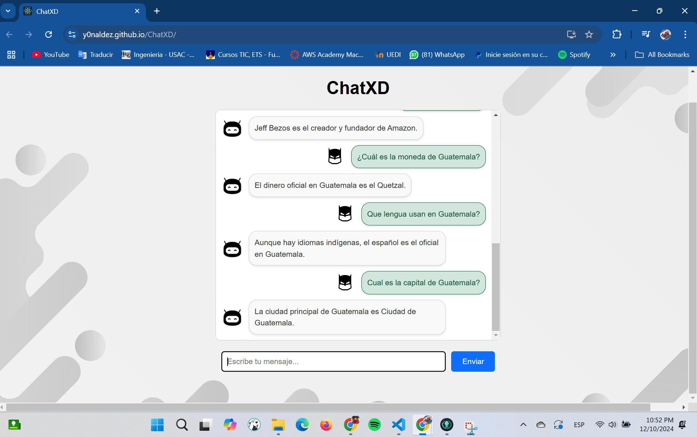

# **Manual De Usuario Proyecto Fase 1 Inteligencia Artificial 1**

## **Descripción del proyecto**

Usted como estudiante de la carrera de ingeniería en ciencias y sistemas ha sido seleccionado
para desarrollar un modelo de inteligencia artificial, este modelo será desarrollado durante el
transcurso de un mes y de forma incremental. La primera semana se deberá utilizar para
poder investigar alguna biblioteca del lenguaje de programación JavaScript que permita el
desarrollo de dicho modelo, deberá ser entrenado y debe tener la capacidad de entender y
responder entradas sencillas en idioma español.
El usuario podrá interactuar con este modelo a través de una interfaz gráfica cuya herramienta
de desarrollo queda a discreción suya.

## **Requisitos del sistema**
- CPU, Intel Core 3  2 GHz recomendado.
- RAM, 2 GB recomendado. 
- Sistema Operativo windows 10,11.
- Navegador web.

## Link para ingresar al modelo de inteligencia artificial 

- https://y0naldez.github.io/ChatXD/

## Interfaz de inicio

El usuario puede cargar el sitio web y verá un cuadro de texto donde puede escribir y un boton de enviar para iniciar una conversación.

### Conversacion casual 

### Reconocimiento de sentimientos 

### Reconociento de ideas 

### Interacción humanizada

### Informacion de creacion 

### Calculo de operaciones suma, resta, division, multiplicación. 

### Respuesta de emociones en ingles

### Sugerencias de habilidades

### Continuación natural de conversación

### Cambio de idioma instantáneo

### Nueva manera de conversaciones naturales

### Conocimiento de cultura general

# Fase 3 proyecto chat bot

| Texto | Imagen |
|-------|--------|
| **Saludo con el usuario reconocimiento de sentimientos** |  |

| Texto | Imagen |
|-------|--------|
| **Interacción con el usuario reconocimiento de sentimientos** |  |

| Texto | Imagen |
|-------|--------|
| **Codigo para invertir texto en Python y JS** |  |

| Texto | Imagen |
|-------|--------|
| **Generar codigo fibonacci Py y Js** |  |

| Texto | Imagen |
|-------|--------|
| **Verificación de numero primo** |  |

| Texto | Imagen |
|-------|--------|
| **Codigo para maximo comun divisor** |  |

| Texto | Imagen |
|-------|--------|
| **Codigo Maximo comun divisor** |  |

| Texto | Imagen |
|-------|--------|
| **Codigo minimo comun multiplo** |  |

| Texto | Imagen |
|-------|--------|
| **Codigo para potenciacion de numeros** |  |

| Texto | Imagen |
|-------|--------|
| **Codigo para generar promedios** |  |

| Texto | Imagen |
|-------|--------|
| **Codigo para sumar elementos** |  |

| Texto | Imagen |
|-------|--------|
| **Codigo para contar palabras** |  |

| Texto | Imagen |
|-------|--------|
| **Codigo para convertir a mayusculas** |  |

| Texto | Imagen |
|-------|--------|
| **Codigo para contar vocales** |  |

| Texto | Imagen |
|-------|--------|
| **Codigo para verificar polidromos** |  |

